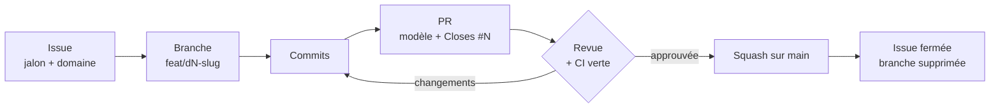

# Méthode de développement

Ce document dit comment une idée devient du code sur `main`. Il reprend la section 5 du document de cadrage, adaptée au prototype. Les règles valent pour les humains comme pour les agents de code.

## Le cycle, de l'issue à main

1. **Une issue d'abord.** Tout travail part d'une issue rattachée à un jalon (M0 à M6) et étiquetée par domaine. Pas d'issue, pas de branche. Les issues des jalons sont déjà ouvertes ; une idée hors jalon va dans une issue sans jalon, triée à la revue de fin de jalon.
2. **Lire avant d'écrire.** Relire les ADR cités dans l'issue et le contrat concerné dans [docs/contracts/](docs/contracts/README.md). Si l'issue contredit un ADR, s'arrêter : l'ADR change d'abord (étape 8).
3. **Une branche courte** depuis `main` à jour, nommée d'après l'issue : `feat/d3-tts-route`. Trois jours de vie au plus ; au-delà, on découpe.
4. **Des commits libres** au format ci-dessous. Ils peuvent être brouillons : seul le titre de la PR reste dans l'historique.
5. **Une PR tôt**, en brouillon si besoin, remplie avec le modèle, avec `Closes #N`.
6. **La revue**, puis la fusion en squash par l'auteur, une fois la CI verte et l'approbation obtenue.
7. **La clôture** : l'issue se ferme par `Closes #N`, la branche est supprimée automatiquement, la ligne du CHANGELOG est dans la PR.
8. **Changer une décision** : une PR étiquetée `adr`, qui ne touche que `docs/adr/`, fusionnée avant toute PR de code qui en dépend.



## Domaines

Cinq domaines, chacun avec un propriétaire. Au démarrage, une seule personne les tient tous ; la table sert à étiqueter les issues, à savoir qui relit quoi quand l'équipe grandit, et à éviter que deux personnes touchent le même fichier le même jour.

| Domaine | Étiquette | Périmètre | Répertoires | Ne touche pas |
|---|---|---|---|---|
| D1 — Brassard | `d1-brassard` | PWA : vue plein écran, capture micro, lecture audio, client temps réel, haptique | `app/resources/views/band`, `app/resources/js/band`, `app/public` | l'orchestrateur |
| D2 — Orchestrateur | `d2-orchestrateur` | providers LLM, outils, streaming, découpage en phrases, prompts, jobs de tour, routes et événements | `app/app/Llm`, `app/app/Tools`, `app/app/Orchestrator`, `app/app/Jobs`, `app/app/Events`, `app/routes`, `app/resources/prompts` | l'unité ai |
| D3 — Voix et modèles | `d3-ai` | unité ai : façade voix, worker TTS, Ollama, poids ; client HTTP côté Laravel | `ai/` (sauf `ai/jarvis-voice`), `app/app/Voice` | le code de jarvis-voice |
| D4 — Données | `d4-donnees` | migrations, modèles Eloquent, appairage, Filament | `app/database`, `app/app/Models`, `app/app/Filament` | la PWA |
| D5 — Infra | `d5-infra` | Docker, Makefile, CI, Tailscale, scripts, mesures, revue transverse | `docker/`, `scripts/`, `.github/`, `Makefile`, `compose.yaml` | le métier |

D5 est le relecteur de secours : il passe sur toute PR qui touche plus d'un domaine. L'arborescence complète et ses propriétaires sont dans [docs/structure.md](docs/structure.md).

## Branches

- `main` — protégée, toujours démontrable. Personne ne pousse dessus directement. Sur un dépôt privé, GitHub n'applique la protection qu'avec un compte Pro : en attendant, la règle tient par discipline ([#6](https://github.com/AVTAVANTTOUT2/dumont/issues/6)).
- `feat/<domaine>-<slug>` — une fonctionnalité : `feat/d1-push-to-talk`.
- `fix/<domaine>-<slug>` — une correction : `fix/d3-relance-worker-tts`.
- `chore/<domaine>-<slug>` — outillage, dépendances : `chore/d5-cache-composer-ci`.
- `docs/<domaine>-<slug>` — documentation et ADR : `docs/d2-adr-repli-llm`.

Pas de `develop`, pas de branche de release, pas de GitFlow. Une branche fusionnée est supprimée.

## Commits

Conventional Commits : `type(domaine): sujet`. Type en anglais, sujet en français, à l'impératif, sans point final.

```text
feat(d3): ajouter la route POST /tts à la façade
fix(d1): déverrouiller l'audio au premier appui sur iOS
docs(d2): préciser le repli sur Ollama dans l'ADR-007
```

- Types autorisés : `feat`, `fix`, `chore`, `refactor`, `docs`, `perf`.
- Domaine : `d1` à `d5`. On l'omet pour un changement vraiment transverse.
- Un commit écrit avec un agent de code porte sa ligne `Co-Authored-By`.

## Pull requests

### Format

- **Titre** : au format des commits, c'est le message du commit squashé. `feat(d1): ajouter le push-to-talk`.
- **Description** : le [modèle](.github/pull_request_template.md), quatre lignes et la référence à l'issue, pas une de plus :

```markdown
**Ce que ça fait :** une phrase.
**Comment le vérifier :** une commande, ou un geste sur le téléphone.
**Contrat modifié :** non — ou lequel (route, événement, table, service ai).
**ADR concerné :** aucun — ou ADR-NNN.

Closes #N
```

### Règles

| Règle | Valeur | Pourquoi |
|---|---|---|
| Taille | 400 lignes modifiées au plus, hors fichiers générés et verrous | au-delà, la revue devient un coup de tampon |
| Relecture | 1 relecteur dès qu'on est deux, 2 si l'étiquette `contract` est posée | la vitesse d'abord |
| Délai de revue | 4 h ouvrées, sinon relance en visio | personne n'attend une journée |
| CI | verte obligatoire, dès qu'elle existe (M0) | aucune exception, même la veille d'une démo |
| Fusion | squash uniquement | un commit par PR sur `main`, historique lisible |
| Qui fusionne | l'auteur, après approbation | pas de goulot d'étranglement |

Tant qu'on est seul, on ouvre quand même une PR pour chaque changement et on la fait relire par un agent (`/code-review` dans Claude Code) avant de fusionner.

### Étiquettes

| Étiquette | Sens | Effet sur les règles |
|---|---|---|
| `d1-brassard` … `d5-infra` | domaine concerné | désigne le relecteur |
| `contract` | modifie une route, un événement temps réel, un schéma de table ou le service ai | `docs/contracts/` mis à jour dans la même PR, deux relecteurs, annonce à l'équipe |
| `adr` | modifie un ADR | PR dédiée, sans code |
| `bug` | comportement faux | priorité sur le travail du jalon |
| `decision` | décision à trancher | se ferme par un ADR ou une ligne dans la feuille de route |
| `bloque` | attend une dépendance ou une décision | signalé au point quotidien |

Ajouter une route, un événement ou une table est libre, à condition de le documenter dans le contrat. Renommer ou changer le sens d'un élément existant exige l'étiquette `contract`.

## Intégration continue

Livrée au M0 : un seul workflow GitHub Actions, trois minutes au plus, sinon on coupe des étapes.

1. `pint --test` — formatage PHP.
2. `phpstan` niveau 4 — les erreurs franches, pas le style.
3. `pest` — les catégories de l'[ADR-018](docs/adr/018-tests-cibles.md).
4. `ruff` et `pytest -m contract` sur l'unité ai, moteurs simulés.
5. Construction de l'image `app`, sans publication.

Pas de déploiement automatique : le prototype vit sur le Mac, et `make up` suffit.

## Définition de fini

Une issue est finie quand tout ce qui suit est vrai. Sinon elle reste ouverte, même si le code est écrit.

- [ ] Le comportement se voit depuis le téléphone ou depuis Filament ; pour l'unité ai, par une commande `curl` écrite dans la PR.
- [ ] La CI est verte.
- [ ] La PR est approuvée, ou relue par un agent tant qu'on est seul.
- [ ] Les routes, événements et tables ajoutés sont décrits dans `docs/contracts/`.
- [ ] Le CHANGELOG a sa ligne si le changement est visible.
- [ ] Les mesures sont reportées dans [docs/mesures.md](docs/mesures.md) si l'issue en demande.
- [ ] La branche est supprimée et l'issue fermée.

## Jalons et versions

Un jalon se termine par une démonstration sur le téléphone, puis :

1. une revue d'ADR d'une heure, décisions écrites le jour même ;
2. la rubrique « Non publié » du CHANGELOG devient la version du jalon ;
3. un tag annoté `v0.N.0` sur `main` ;
4. la milestone GitHub est fermée.

| Jalon | Version |
|---|---|
| M0 — Socle | 0.1.0 |
| M1 — Jarvis parle | 0.2.0 |
| M2 — Jarvis entend | 0.3.0 |
| M3 — Jarvis répond | 0.4.0 |
| M4 — Jarvis se souvient | 0.5.0 |
| M5 — Jarvis obéit | 0.6.0 |
| M6 — Prototype fonctionnel | 0.7.0 |

## Rituels, quand l'équipe est à plusieurs

- Point quotidien de 15 minutes, debout : fini, en cours, bloqué.
- Démonstration hebdomadaire le vendredi, 30 minutes, depuis le téléphone sur le Mac de démonstration.
- Revue d'ADR en fin de jalon uniquement.

## Travailler avec un agent de code

- L'agent lit [CLAUDE.md](CLAUDE.md), l'issue et les ADR qu'elle cite avant d'écrire.
- Une issue, une session, une PR.
- L'agent ouvre la PR ; l'humain relit et fusionne.

## Style

- PHP : Pint (préréglage Laravel), PHPStan niveau 4.
- Python : ruff pour le lint et le format ; 3.12 pour la façade, 3.14 pour le worker TTS.
- JavaScript du brassard : modules ES natifs, sans framework ([ADR-009](docs/adr/009-telephone-pwa-brassard.md)).
- Langues : français pour la documentation, l'interface, les prompts et les sujets de commit ; anglais pour les classes, tables, colonnes, routes et variables ([ADR-019](docs/adr/019-francais-produit-anglais-code.md)).
