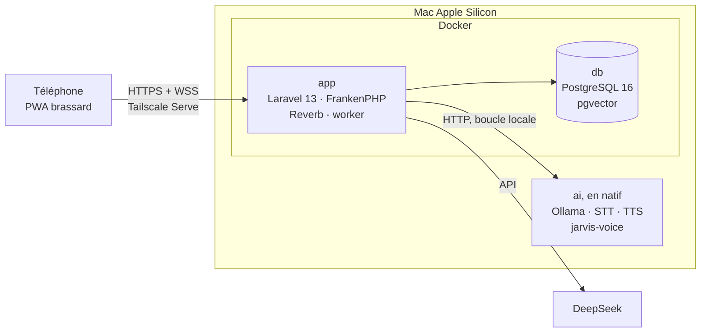

# Dumont

Assistant vocal **Jarvis** porté au bras. On lui parle depuis le téléphone, il répond à voix haute, affiche ce qui compte et exécute les commandes. Le téléphone sert de brassard (*gauntlet*) grâce à une application web installable (PWA). Tout le calcul tourne sur un Mac Apple Silicon : modèle de langage local, transcription et voix de [jarvis-voice](https://github.com/AVTAVANTTOUT2/jarvis-voice).

> **État au 21 septembre 2026 :** documentation posée, squelette Laravel 13 dans `app/`. Le jalon **M0 — Socle** continue (Docker, unité ai, HTTPS, CI). Voir la [feuille de route](docs/roadmap.md).

## En une image



| Unité | Où elle tourne | Ce qu'elle porte |
|---|---|---|
| `ai` | en natif sur le Mac | Ollama sur GPU Metal ; façade voix : STT faster-whisper et TTS Qwen3 via MLX (jarvis-voice) |
| `app` | conteneur Docker | Laravel 13 sur FrankenPHP : API, PWA du brassard, Reverb, file de jobs, Filament |
| `db` | conteneur Docker | PostgreSQL 16 avec pgvector |

`ai` reste hors de Docker parce que Docker sur macOS n'accède pas au GPU : ni la voix Jarvis (MLX) ni Ollama accéléré n'y tourneraient ([ADR-004](docs/adr/004-unite-ai-native.md)).

## Premier objectif

Faire **parler** Jarvis sur le téléphone (M1), puis qu'il nous **entende** (M2), puis qu'il **réponde** (M3). Les commandes arrivent ensuite (M5). Le prototype fonctionnel est atteint à la fin du M6.

## Documentation

| Document | Contenu |
|---|---|
| [Vision](docs/vision.md) | Ce qu'on construit, pour qui, et ce qu'on ne construit pas |
| [Architecture](docs/architecture.md) | Les trois unités, le réseau, le chemin d'un tour de parole, la configuration |
| [Structure du dépôt](docs/structure.md) | Arborescence cible et propriétaire de chaque répertoire |
| [Feuille de route](docs/roadmap.md) | Jalons M0 à M6 jusqu'au prototype fonctionnel |
| [ADR](docs/adr/README.md) | Les dix-neuf décisions d'architecture |
| [Contrats](docs/contracts/README.md) | API REST, événements temps réel, service ai, modèle de données |
| [Brassard PWA](docs/brassard-pwa.md) | Écrans, interactions, contraintes iPhone et Android |
| [Mesures](docs/mesures.md) | Latences et mémoire, relevées à chaque jalon |
| [Méthode de développement](CONTRIBUTING.md) | Cycle de travail, branches, commits, format des PR, définition de fini |
| [Journal des versions](CHANGELOG.md) | Ce qui change, version par version |

## Prérequis sur le Mac

- Mac Apple Silicon, 24 Go de mémoire unifiée conseillés
- Docker Desktop, uv, ffmpeg, Ollama, Tailscale (aussi sur le téléphone)
- Accès au dépôt privé `jarvis-voice`
- Une clé API DeepSeek

## Démarrer

Ces commandes sont la cible du jalon M0 : elles n'existent pas encore.

```bash
git clone --recurse-submodules https://github.com/AVTAVANTTOUT2/dumont.git
```

```bash
make setup    # vérifie le Mac, crée .env
make models   # poids de la voix (~3,2 Go) et modèles Ollama
make up       # unité ai en natif, puis app et db dans Docker
make phone    # publie https://<mac>.<tailnet>.ts.net pour le téléphone
```

## Contribuer

Tout part d'une issue, passe par une branche courte et arrive sur `main` par une PR fusionnée en squash. Le détail est dans [CONTRIBUTING.md](CONTRIBUTING.md). Les agents de code lisent d'abord [CLAUDE.md](CLAUDE.md).

Dépôt privé. La voix `jarvis-fr` n'est pas redistribuable et ne doit jamais être copiée ici.
