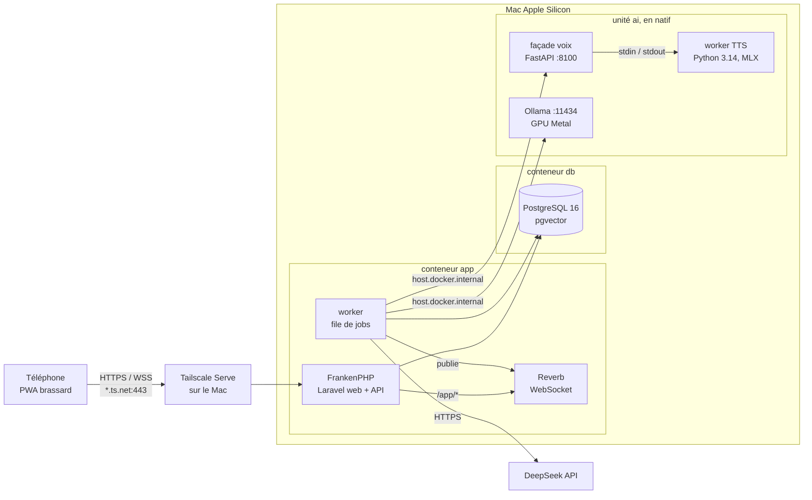
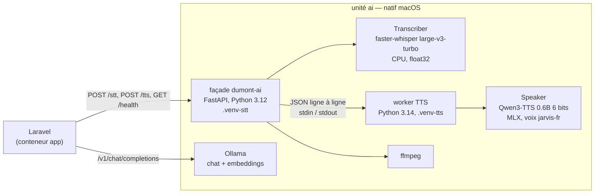
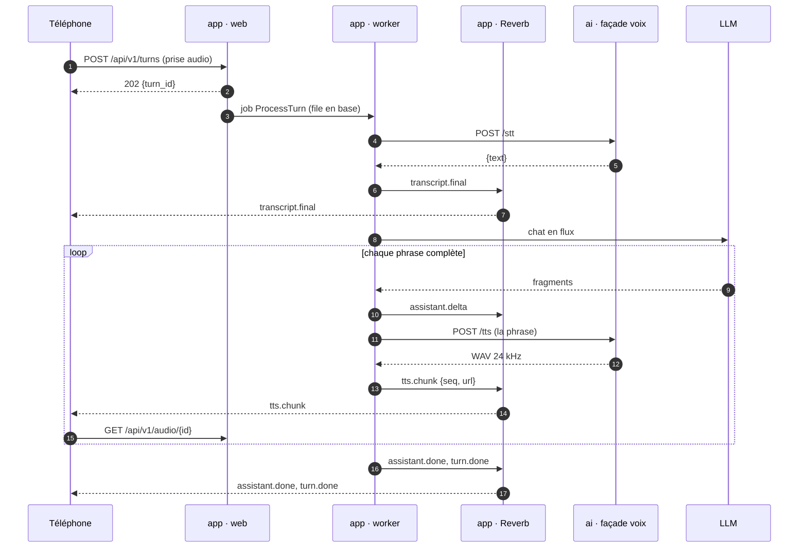

# Architecture

Trois unités sur un seul Mac Apple Silicon, un dépôt, une commande `make up`. Laravel porte le web, le temps réel et l'orchestration. L'unité ai porte le modèle de langage local, la transcription et la voix. Le téléphone ne parle qu'à Laravel.

## Vue d'ensemble

Le téléphone ne joint jamais l'unité ai ni le LLM directement. Tout passe par Laravel, qui authentifie, journalise et applique les droits.

## Les trois unités

| Unité | Où | Processus | Écoute | Redémarrage |
|---|---|---|---|---|
| `ai` | natif macOS | `ollama serve` ; façade voix `dumont-ai` (Python 3.12, STT en mémoire) ; worker TTS (Python 3.14, enfant de la façade) | 127.0.0.1:11434, 127.0.0.1:8100 | `make ai` au début, LaunchAgent au M6 |
| `app` | conteneur Docker | FrankenPHP (web, API, PWA) ; `reverb:start` ; `queue:work`, les trois sous supervisord | 127.0.0.1:8080 sur le Mac ; Reverb sur 127.0.0.1:8081 dans le conteneur | `restart: unless-stopped` ; supervisord relance chaque processus |
| `db` | conteneur Docker | PostgreSQL 16 avec pgvector (`pgvector/pgvector:pg16`) | 127.0.0.1:5432 sur le Mac, `db:5432` pour app | `restart: unless-stopped` |

Pourquoi trois unités et pas les sept conteneurs du cadrage : [ADR-003](adr/003-trois-unites-un-mac.md). Pourquoi ai hors de Docker : [ADR-004](adr/004-unite-ai-native.md).

### Unité app

Une image FrankenPHP (PHP 8.5), trois processus :

- **web** — FrankenPHP en mode classique. Le Caddyfile envoie `/app/*` et `/apps/*` vers Reverb, tout le reste à Laravel. Le téléphone n'a donc qu'une origine, en HTTPS, pour l'API, la PWA et le WebSocket ([ADR-002](adr/002-reverb-temps-reel.md)).
- **reverb** — serveur WebSocket au protocole Pusher, sur 127.0.0.1:8081 à l'intérieur du conteneur.
- **worker** — `queue:work --sleep=0.2` sur la file en base. Tout tour de parole s'exécute ici, jamais dans la requête HTTP ([ADR-014](adr/014-streaming-synthese-par-phrase.md)).

Le code est monté depuis `./app` en développement : pas de reconstruction d'image pour changer une ligne de PHP.

### Unité ai

jarvis-voice impose deux interpréteurs : le STT en Python 3.12, le TTS en Python 3.14. La façade tourne dans le premier et garde le Transcriber en mémoire ; elle lance et surveille un worker TTS persistant dans le second, qui charge le Speaker une seule fois. Un seul port, une seule santé, un seul cycle de vie. Ollama est un processus voisin que Laravel appelle directement dans son dialecte OpenAI. Contrat complet : [contracts/ai-service.md](contracts/ai-service.md).

### Unité db

Une base `dumont`, l'extension `vector` créée à l'initialisation. File de jobs, cache et sessions Laravel y vivent aussi : pas de Redis ([ADR-006](adr/006-postgres-pgvector-sans-redis.md)). Schéma : [contracts/data-model.md](contracts/data-model.md).

## Réseau et ports

| De | Vers | Adresse | Protocole |
|---|---|---|---|
| Téléphone | Tailscale Serve | `https://<mac>.<tailnet>.ts.net` | HTTPS, WSS |
| Tailscale Serve | app, web | `http://127.0.0.1:8080` | HTTP |
| app, web | app, Reverb | `127.0.0.1:8081` (dans le conteneur) | HTTP, WebSocket |
| app, worker | app, Reverb | `127.0.0.1:8081` | HTTP (API de publication Pusher) |
| app | db | `db:5432` | PostgreSQL |
| app | façade voix | `http://host.docker.internal:8100` | HTTP |
| app | Ollama | `http://host.docker.internal:11434` | HTTP |
| app, worker | DeepSeek | `https://api.deepseek.com` | HTTPS |

Règle : rien n'écoute sur le réseau local. app et db publient leurs ports sur 127.0.0.1, l'unité ai écoute sur 127.0.0.1, et seul Tailscale Serve rend l'app joignable, dans le tailnet uniquement ([ADR-010](adr/010-https-tailscale-serve.md)). Que Docker Desktop relaie bien `host.docker.internal` vers des services en boucle locale se vérifie au M0 ; si ce n'est pas le cas, la parade passe par un ADR, jamais par une ouverture de l'unité ai au réseau.

## Le chemin d'un tour de parole

Au prototype, une prise commence à l'appui sur le bouton et s'arrête au relâché ([ADR-013](adr/013-push-to-talk-dabord.md)). L'audio monte en HTTP, les événements redescendent par WebSocket ([ADR-012](adr/012-audio-http-evenements-ws.md)).

La synthèse part phrase par phrase : la première phrase sonne pendant que le modèle écrit encore. C'est là que se gagne la latence ([ADR-014](adr/014-streaming-synthese-par-phrase.md)).

## Budget de latence

Hypothèses à confirmer par les [mesures](mesures.md). Cible du prototype : moins de 3 secondes en médiane entre la fin de la prise et le premier son.

| Étape | Hypothèse | Mesurée au |
|---|---|---|
| Envoi de la prise par Tailscale | 0,1 s | M2 |
| Mise en file et prise en charge par le worker | 0,1 s | M2 |
| STT de 5 s d'audio (large-v3-turbo, CPU) | 0,7 s | M2 |
| Premier fragment LLM (deepseek-flash) | 0,6 s | M3 |
| Fin de la première phrase | 0,3 s | M3 |
| TTS de la première phrase (Qwen3, MLX) | 0,8 s | M1 |
| Téléchargement et décodage du WAV | 0,1 s | M1 |
| **Total** | **≈ 2,7 s** | M3 |

Si le TTS dépasse son budget : consigne de première phrase très courte dans le prompt, puis, en dernier recours, un court son d'accusé de réception joué pendant la synthèse.

## Budget mémoire

24 Go de mémoire unifiée partagés entre tout ce qui précède.

| Poste | Estimation |
|---|---|
| macOS et applications ouvertes | 6 Go |
| Docker Desktop (app et db), VM plafonnée à 4 Go | 2 Go |
| STT large-v3-turbo en float32 | 3 Go |
| TTS Qwen3 0.6B 6 bits et tokenizer audio | 2,5 Go |
| Ollama, qwen2.5:7b en Q4 avec son contexte | 5,5 Go |
| **Total** | **≈ 19 Go** |

DeepSeek étant le provider par défaut, le modèle Ollama n'est chargé qu'en repli ou en mode local, puis déchargé après cinq minutes d'inactivité. Le qwen2.5:14b déjà présent sur le Mac (9 Go) ne laisserait pas assez de marge à la voix ([ADR-007](adr/007-providers-llm-interchangeables.md)).

## Configuration

Un seul fichier `.env` à la racine, lu par Docker Compose et injecté dans le conteneur app comme variables d'environnement ; l'unité ai lit les siennes dans le même fichier. `.env.example` arrive au M0 avec ces variables et aucune valeur secrète.

| Variable | Valeur au prototype | Rôle |
|---|---|---|
| `APP_URL` | `https://<mac>.<tailnet>.ts.net` | origine publique de la PWA |
| `APP_LOCALE` | `fr` | langue de l'interface |
| `APP_PORT` | `8080` | port d'app sur 127.0.0.1 |
| `DB_CONNECTION`, `DB_HOST`, `DB_PORT` | `pgsql`, `db`, `5432` | base |
| `DB_DATABASE`, `DB_USERNAME`, `DB_PASSWORD` | `dumont`, `dumont`, secret | identifiants |
| `QUEUE_CONNECTION`, `CACHE_STORE`, `SESSION_DRIVER` | `database` | pas de Redis |
| `BROADCAST_CONNECTION` | `reverb` | temps réel |
| `REVERB_SERVER_HOST`, `REVERB_SERVER_PORT` | `127.0.0.1`, `8081` | écoute de Reverb dans le conteneur |
| `REVERB_HOST`, `REVERB_PORT`, `REVERB_SCHEME` | `127.0.0.1`, `8081`, `http` | publication depuis Laravel |
| `REVERB_APP_ID`, `REVERB_APP_KEY`, `REVERB_APP_SECRET` | générés au M0 | application Pusher |
| `VITE_REVERB_PORT`, `VITE_REVERB_SCHEME` | `443`, `https` | connexion du téléphone, même origine |
| `AI_URL` | `http://host.docker.internal:8100` | façade voix vue depuis app |
| `AI_TIMEOUT` | `30` | délai max d'un appel STT ou TTS, en secondes |
| `LLM_DRIVER` | `deepseek` | provider principal : `deepseek` ou `ollama` |
| `LLM_TIMEOUT` | `8` | délai avant premier fragment, au-delà repli sur Ollama |
| `DEEPSEEK_API_KEY` | secret | clé DeepSeek, avec plafond mensuel |
| `DEEPSEEK_BASE_URL`, `DEEPSEEK_MODEL` | `https://api.deepseek.com`, `deepseek-flash` | provider distant |
| `OLLAMA_BASE_URL` | `http://host.docker.internal:11434` | Ollama vu depuis app |
| `OLLAMA_CHAT_MODEL`, `OLLAMA_EMBED_MODEL` | `qwen2.5:7b`, `bge-m3` | modèles locaux |

## Sécurité

- Aucun port n'écoute sur le réseau local ; l'accès distant passe par le tailnet, jamais par Internet.
- La façade voix n'a pas d'authentification : sa sécurité repose entièrement sur l'écoute en boucle locale.
- Le téléphone s'authentifie par jeton d'appareil, révocable ([ADR-011](adr/011-jeton-appareil.md)).
- Les secrets vivent dans `.env`, jamais dans Git.
- Les embeddings ne sortent pas du Mac ([ADR-008](adr/008-embeddings-locaux.md)) ; en revanche le texte des demandes part chez DeepSeek quand il est le provider actif.

## Écarts avec le document de cadrage

Le document de cadrage du 21 septembre 2026 reste la référence de la vision. Là où il diffère de ce qui suit, les ADR de ce dépôt l'emportent.

| Sujet | Cadrage | Décision | Référence |
|---|---|---|---|
| Déploiement | 7 conteneurs, 2 machines | 3 unités sur un Mac : ai en natif, app et db dans Docker | [ADR-003](adr/003-trois-unites-un-mac.md), [ADR-004](adr/004-unite-ai-native.md) |
| Voix | sidecar `voice` en conteneur, TTS à part sur un Mac | façade voix native, avec Ollama, dans l'unité ai | [ADR-004](adr/004-unite-ai-native.md) |
| Redis | cache, file, sessions, présence | retiré : tout en base | [ADR-006](adr/006-postgres-pgvector-sans-redis.md) |
| Versions | Laravel 12, Filament 4 | Laravel 13, Filament 5, versions courantes | [ADR-001](adr/001-laravel-socle-unique.md), [ADR-017](adr/017-filament-administration.md) |
| Brassard | page web sur carte dédiée ou Android en kiosque | PWA sur le téléphone de l'utilisateur, iPhone ou Android | [ADR-009](adr/009-telephone-pwa-brassard.md) |
| HTTPS | non traité | Tailscale Serve | [ADR-010](adr/010-https-tailscale-serve.md) |
| Audio montant | blocs de 280 ms en WebSocket (`audio.chunk`) | une prise entière par POST HTTP | [ADR-012](adr/012-audio-http-evenements-ws.md) |
| Audio descendant | WAV dans l'événement `tts.chunk` | URL dans `tts.chunk`, WAV téléchargé | [ADR-012](adr/012-audio-http-evenements-ws.md) |
| Écoute | continue | push-to-talk, puis mains libres au M6 | [ADR-013](adr/013-push-to-talk-dabord.md) |
| Table des échanges | `sessions` | `conversations` et `turns` : `sessions` appartient à Laravel | [data-model](contracts/data-model.md) |
| Canal temps réel | `session.{id}` | `conversation.{id}` | [realtime](contracts/realtime.md) |
| Journal | droit Postgres restreint | déclencheur qui refuse UPDATE, DELETE et TRUNCATE | [ADR-015](adr/015-journal-ajout-seul.md) |
| Plan | 7 lots de 2 semaines à 5 développeurs, jusqu'à la V1 | 7 jalons courts jusqu'au prototype, la V1 ensuite | [roadmap](roadmap.md) |
