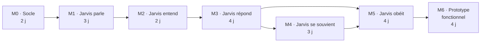

# Feuille de route jusqu'au prototype fonctionnel

Sept jalons courts, de M0 à M6. Chacun se termine par une démonstration **sur le téléphone** et une version. L'ordre suit le premier objectif : que Jarvis parle, puis qu'il entende, puis qu'il réponde ; les commandes viennent ensuite.

Le suivi vit dans les [milestones GitHub](https://github.com/AVTAVANTTOUT2/dumont/milestones). Chaque ligne des tableaux ci-dessous est une issue ouverte, prête à être prise.

## Vue d'ensemble

| Jalon | Livrable démontrable | Version | Estimation |
|---|---|---|---|
| M0 — Socle | `make up`, puis le téléphone affiche « Dumont en ligne » en HTTPS avec trois pastilles vertes | 0.1.0 | 2 j |
| M1 — Jarvis parle | une phrase tapée sur le téléphone sort du haut-parleur avec la voix de Jarvis | 0.2.0 | 3 j |
| M2 — Jarvis entend | je parle, le texte s'affiche, Jarvis me le répète avec sa voix | 0.3.0 | 2 j |
| M3 — Jarvis répond | conversation vocale, moins de 3 s entre la fin de la prise et le premier son | 0.4.0 | 4 j |
| M4 — Jarvis se souvient | chaque échange visible et réécoutable, sur le téléphone et dans Filament | 0.5.0 | 3 j |
| M5 — Jarvis obéit | « Jarvis, note que… » crée une note affichée en carte ; « passe en local » bascule sur Ollama | 0.6.0 | 4 j |
| M6 — Prototype fonctionnel | scénario de trois minutes, mains libres, sans toucher le Mac | 0.7.0 | 4 j |

Estimations en jours de travail pour une personne assistée d'un agent de code : environ 22 jours, soit quatre à cinq semaines à plein temps. Le premier objectif — Jarvis parle et nous entend — est atteint à la fin du M2, vers le septième jour.

Le chemin contraint est M0 → M1 → M2 → M3. Le journal du M4 peut commencer dès le M2, en parallèle, sans dépendre de personne.

## M0 — Socle

**Objectif.** Un environnement complet sur le Mac en une commande, joignable depuis le téléphone en HTTPS.

| Issue | Tâche | Domaine |
|---|---|---|
| [#1](https://github.com/AVTAVANTTOUT2/dumont/issues/1) | Installer Laravel 13 dans `app/` avec Sanctum, Reverb et Pest | D5 |
| [#2](https://github.com/AVTAVANTTOUT2/dumont/issues/2) | Écrire `compose.yaml`, l'image app et le Makefile | D5 |
| [#3](https://github.com/AVTAVANTTOUT2/dumont/issues/3) | Monter l'unité ai : sous-module jarvis-voice, deux environnements, façade `/health` | D3 |
| [#4](https://github.com/AVTAVANTTOUT2/dumont/issues/4) | Publier l'app en HTTPS pour le téléphone avec Tailscale Serve | D5 |
| [#5](https://github.com/AVTAVANTTOUT2/dumont/issues/5) | Route `GET /api/v1/health` et page « Dumont en ligne » | D1, D2 |
| [#6](https://github.com/AVTAVANTTOUT2/dumont/issues/6) | Mettre en place la CI et protéger `main` | D5 |

**Sortie.** `git clone`, `make setup`, `make models`, `make up` donnent l'environnement complet ; la page s'ouvre sur le téléphone avec un cadenas, y compris hors du Wi-Fi de la maison ; la CI est verte sur une PR vide.

## M1 — Jarvis parle

**Objectif.** Le chemin de la voix, de bout en bout, sans micro ni LLM : texte → synthèse → haut-parleur du téléphone.

| Issue | Tâche | Domaine |
|---|---|---|
| [#7](https://github.com/AVTAVANTTOUT2/dumont/issues/7) | Façade : `POST /tts` avec un worker TTS persistant | D3 |
| [#8](https://github.com/AVTAVANTTOUT2/dumont/issues/8) | PWA installable : manifest, service worker, icônes | D1 |
| [#9](https://github.com/AVTAVANTTOUT2/dumont/issues/9) | Appairer le téléphone par code à six chiffres et jeton Sanctum | D4 |
| [#10](https://github.com/AVTAVANTTOUT2/dumont/issues/10) | Temps réel : Echo sur Reverb via `/app`, canal `conversation.{id}` | D2 |
| [#11](https://github.com/AVTAVANTTOUT2/dumont/issues/11) | `POST /api/v1/say` : job de synthèse, `tts.chunk` et `turn.done` | D2 |
| [#12](https://github.com/AVTAVANTTOUT2/dumont/issues/12) | Lire les `tts.chunk` dans l'ordre sur le téléphone | D1 |

**Sortie.** La PWA est installée sur l'écran d'accueil ; « Présente-toi » fait parler Jarvis, deux phrases enchaînées sans blanc audible. **Mesure :** latence TTS d'une phrase de quinze mots.

## M2 — Jarvis entend

**Objectif.** Le chemin du micro : prise → transcription → affichage, et la boucle complète voix → texte → voix en mode écho.

| Issue | Tâche | Domaine |
|---|---|---|
| [#13](https://github.com/AVTAVANTTOUT2/dumont/issues/13) | Push-to-talk : capture et envoi `POST /api/v1/turns` | D1 |
| [#14](https://github.com/AVTAVANTTOUT2/dumont/issues/14) | Façade : `POST /stt` avec ffmpeg et faster-whisper | D3 |
| [#15](https://github.com/AVTAVANTTOUT2/dumont/issues/15) | Job `ProcessTurn` : transcription et `transcript.final` | D2 |
| [#16](https://github.com/AVTAVANTTOUT2/dumont/issues/16) | Mode écho : Jarvis répète ce qu'il a entendu | D2 |

**Sortie.** Premier objectif atteint : on parle à Jarvis, il affiche ce qu'il a compris et le répète avec sa voix, sur iPhone comme sur Android. **Mesure :** latence STT sur cinq secondes d'audio.

## M3 — Jarvis répond

**Objectif.** Une vraie conversation : le LLM répond en flux, chaque phrase est synthétisée dès qu'elle est complète.

| Issue | Tâche | Domaine |
|---|---|---|
| [#17](https://github.com/AVTAVANTTOUT2/dumont/issues/17) | `LlmProvider` : DeepSeek, Ollama et repli automatique | D2 |
| [#18](https://github.com/AVTAVANTTOUT2/dumont/issues/18) | Orchestrateur en flux : découpage par phrase et TTS en pipeline | D2 |
| [#19](https://github.com/AVTAVANTTOUT2/dumont/issues/19) | Prompt système de Jarvis et mémoire courte | D2 |
| [#20](https://github.com/AVTAVANTTOUT2/dumont/issues/20) | Réponse en flux et mode dégradé dans la PWA | D1 |
| [#21](https://github.com/AVTAVANTTOUT2/dumont/issues/21) | Mesurer la latence de bout en bout | D5 |

**Sortie.** Vingt questions de référence répondues à voix haute ; médiane de moins de 3 s entre la fin de la prise et le premier son ; Ollama prend le relais quand DeepSeek est coupé. **Mesure :** latence de bout en bout, par provider.

## M4 — Jarvis se souvient

**Objectif.** Tout ce qui se passe est tracé, consultable et réécoutable.

| Issue | Tâche | Domaine |
|---|---|---|
| [#22](https://github.com/AVTAVANTTOUT2/dumont/issues/22) | Journal `events` en ajout seul | D4 |
| [#23](https://github.com/AVTAVANTTOUT2/dumont/issues/23) | Back-office Filament 5 | D4 |
| [#24](https://github.com/AVTAVANTTOUT2/dumont/issues/24) | Écran Historique avec réécoute dans la PWA | D1 |

**Sortie.** Un échange de la veille se retrouve et se réécoute sur le téléphone ; dans Filament, le journal le décrit étape par étape et refuse toute modification.

## M5 — Jarvis obéit

**Objectif.** Jarvis exécute des commandes et le tableau de bord du brassard les montre.

| Issue | Tâche | Domaine |
|---|---|---|
| [#25](https://github.com/AVTAVANTTOUT2/dumont/issues/25) | Socle des outils : `app/Tools`, `tool.started`, `tool.done` | D2 |
| [#26](https://github.com/AVTAVANTTOUT2/dumont/issues/26) | Premiers outils : heure, notes, rappel, état du système, bascule de modèle | D2 |
| [#27](https://github.com/AVTAVANTTOUT2/dumont/issues/27) | Cartes `ui.render` et motifs haptiques | D1 |

**Sortie.** « Jarvis, note que la porte du garage grince » crée une note affichée en carte ; « rappelle-moi dans deux minutes » déclenche une alerte ; « passe en local » bascule sur Ollama et Jarvis le confirme.

## M6 — Prototype fonctionnel

**Objectif.** Mains libres, robuste, démontrable sans filet.

| Issue | Tâche | Domaine |
|---|---|---|
| [#28](https://github.com/AVTAVANTTOUT2/dumont/issues/28) | Mains libres : détection de parole et adresse « Jarvis » | D1, D3 |
| [#29](https://github.com/AVTAVANTTOUT2/dumont/issues/29) | Démarrage automatique, reprise après coupure et sauvegarde | D5 |
| [#30](https://github.com/AVTAVANTTOUT2/dumont/issues/30) | Scénario de démonstration et bilan du prototype | D5 |

**Sortie.** Le scénario de trois minutes se joue depuis le téléphone, mains libres, après un redémarrage du Mac, sans toucher au clavier. Version 0.7.0.

## Décisions ouvertes

| Décision | Proposition | Échéance | Issue |
|---|---|---|---|
| Téléphone de test principal | celui de l'utilisateur ; la PWA vise iPhone et Android, mais on teste d'abord sur un seul | M0 | [#31](https://github.com/AVTAVANTTOUT2/dumont/issues/31) |
| Modèle Ollama par défaut | `qwen2.5:7b`, à confirmer par la mesure du M3 | M3 | [#32](https://github.com/AVTAVANTTOUT2/dumont/issues/32) |
| Clé DeepSeek et plafond de dépense | plafond mensuel fixé dès le premier jour | M0 | [#33](https://github.com/AVTAVANTTOUT2/dumont/issues/33) |
| Voix `jarvis-fr` hors équipe | démonstrations privées uniquement | avant toute démonstration externe | [#34](https://github.com/AVTAVANTTOUT2/dumont/issues/34) |
| Répartition des domaines D1 à D5 | une seule personne sur les cinq au démarrage | M0 | [#35](https://github.com/AVTAVANTTOUT2/dumont/issues/35) |

## Risques

| Risque | Effet | Parade |
|---|---|---|
| La synthèse ne streame pas | chaque phrase attend sa synthèse complète, la réponse paraît hachée | première phrase courte par consigne ; mesure dès le M1 ; son d'accusé de réception en dernier recours |
| Mémoire du Mac (24 Go) | swap, latences qui explosent | DeepSeek par défaut, `qwen2.5:7b` en local, VM Docker plafonnée, mesure au M3 |
| Contraintes de la PWA sur iPhone | micro ou lecture bloqués, permission redemandée | déverrouillage audio au premier geste, tests sur le vrai téléphone dès le M1 ([brassard-pwa](brassard-pwa.md)) |
| `host.docker.internal` vers la boucle locale | app ne joint pas l'unité ai | vérifié au M0 ; parade par ADR, jamais par ouverture réseau |
| Le Mac est le seul nœud | Mac en veille ou éteint : plus de Jarvis | pas de veille sur secteur, LaunchAgent au M6, message clair sur le téléphone |
| PHP et le flux | worker bloqué, tours perdus | générateurs, un tour par job, délais sur chaque appel externe |
| Dérive du périmètre | on construit la V1 avant d'avoir le prototype | la [vision](vision.md) fixe le hors périmètre ; tout ajout passe par une issue triée en fin de jalon |

## Après le prototype

Ce qui reste du cadrage pour atteindre la V1, dans l'ordre prévu. Chaque lot deviendra un jalon avec ses issues le moment venu.

| Lot | Contenu |
|---|---|
| Notes structurées | dictée continue, types (observation, action, anomalie), pièces jointes, signature, journal de quart |
| Restitution et RAG | documentation indexée avec pgvector et bge-m3 en local, citation des sources |
| Télémétrie | données simulées, questions en langage naturel, graphiques par `ui.render` |
| Communication | messages entre équipiers, résumé, rapport |
| Brassard physique | écran dédié, molette, moteurs vibrants, micro à réduction de bruit — la même PWA |
| Plusieurs appareils | présence, messages croisés, intercom |
